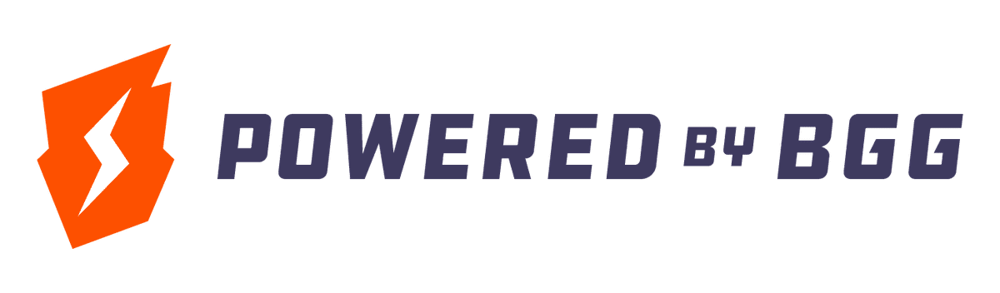

# BGG Data Explorer

An interactive dashboard for analyzing the BoardGameGeek database — exploring mechanic co-occurrences, trends, and underexplored design space niches.

**Live demo:** [solojulian.dev/bgg](https://solojulian.dev/bgg/)


## Features

- **Mechanics Explorer** — Interactive heatmap showing mechanic co-occurrence across 30k+ ranked board games. Filter by year, weight (complexity), and player count.
- **Trend Charts** — Track how mechanics and categories have grown over time, with optional normalization.
- **Market Opportunities** — Treemap and sortable table identifying mechanic/category combos that are popular individually but rarely combined — potential design space gaps.

## Tech Stack

- **Backend:** Python / Flask, SQLite
- **Frontend:** Svelte 5, Vite, ECharts
- **Data source:** [BGG XML API2](https://boardgamegeek.com/wiki/page/BGG_XML_API2) (all 30k ranked games, 192 mechanics, 85 categories)

## Setup

### Prerequisites

- Python 3.12+
- Node.js 18+
- A [BGG API token](https://boardgamegeek.com/applications) (required for data ingestion)
- The `boardgames_ranks.csv` file downloaded from BGG (CSV dump of all ranked games)

### 1. Ingest data

Create a `.env` file (or export the variable) with your BGG API token:

```
BGG_API_TOKEN=your-token-here
```

Place the `boardgames_ranks.csv` in the project root, then run:

```bash
python3 ingest.py
```

This fetches game details from the BGG API in batches and builds `bgg.db`. It's resumable — if interrupted, re-run and it picks up where it left off.

### 2. Quick start

```bash
./run.sh
```

This installs dependencies, builds the frontend, adds database indexes, and starts the Flask server on `http://localhost:5000`.

### Developing

For frontend hot-reload during development:

```bash
# Terminal 1: Flask backend
python3 app.py

# Terminal 2: Vite dev server (proxies /api to Flask)
cd frontend && npm run dev
```

## Project Structure

```
app.py              Flask API server
ingest.py           BGG API -> SQLite ingestion script
run.sh              One-command setup and run
requirements.txt    Python dependencies
frontend/
  src/
    App.svelte              Tab navigation, header/footer
    lib/api.js              Fetch wrapper
    views/
      MechanicDashboard.svelte   Heatmap + trend charts
      MarketOpportunity.svelte   Treemap + opportunity table
  public/
    bgg-logo.png            "Powered by BGG" attribution logo
```

## Data

The database (`bgg.db`) is **not included** in this repo. BGG's [XML API Terms of Use](https://boardgamegeek.com/wiki/page/XML_API_Terms_of_Use) do not permit redistribution of their data. Use `ingest.py` with your own API token to build it.

### Database schema

| Table | Description |
|-------|-------------|
| `games` | Core game data (30k rows) — ratings, weight, player count, play time, etc. |
| `mechanics` | 192 unique mechanics |
| `categories` | 85 unique categories |
| `families` | Game families |
| `designers` | Game designers |
| `game_mechanics` | Game-to-mechanic junction |
| `game_categories` | Game-to-category junction |
| `game_families` | Game-to-family junction |
| `game_designers` | Game-to-designer junction |

## License

Data sourced from [BoardGameGeek](https://boardgamegeek.com) via their XML API. All game data belongs to BGG and its contributors.

[](https://boardgamegeek.com)
